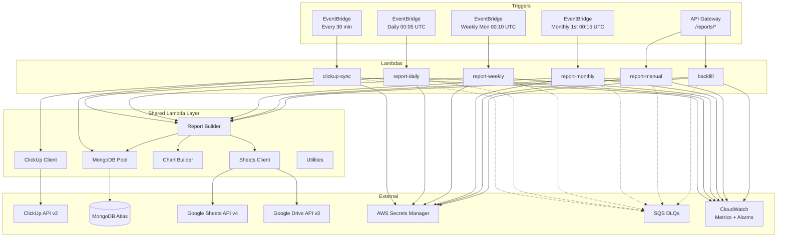
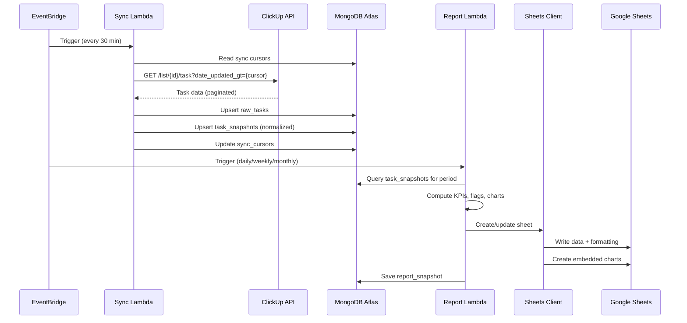

# Design Document: ClickUp Developer Reporting

## Overview

The ClickUp Developer & Team Reporting System is a serverless pipeline built on AWS that automates the collection, processing, and presentation of developer productivity data from ClickUp into formatted Google Sheets reports. The system runs on a scheduled cadence (daily, weekly, monthly) with on-demand and backfill capabilities.

The architecture follows a Lambda-per-function pattern with a shared layer for common logic. Data flows through three stages:

1. **Ingest** — The Sync Lambda fetches incremental task updates from ClickUp every 30 minutes, normalizes statuses, and persists raw + enriched snapshots to MongoDB Atlas.
2. **Compute** — Report Lambdas (daily/weekly/monthly/manual/backfill) query task snapshots, compute 17 KPIs per developer, aggregate team metrics, flag at-risk tasks, and generate chart data.
3. **Publish** — The Sheets Client writes structured data, formatting, hyperlinks, color-coded flags, and embedded charts to Google Sheets via the Sheets API v4 and Drive API v3.

### Key Design Decisions

- **Cursor-based incremental sync** over full re-fetch: reduces ClickUp API load and stays within rate limits for 30-minute cadence.
- **MongoDB Atlas** as the data store: flexible schema for task snapshots with rich querying for report aggregation, plus TTL/indexing for performance.
- **Shared Lambda Layer** for all common modules: single source of truth for DB connections, API clients, report logic, and utilities — avoids code duplication across 6 Lambdas.
- **Google Sheets as output** (not a custom dashboard): zero adoption friction for engineering managers, leverages existing Google Workspace access.
- **AWS SAM** for IaC: native Lambda/EventBridge/API Gateway support, simpler than CDK for this scope.

## Architecture



### Data Flow




## Components and Interfaces

### 1. Sync Lambda (`src/lambdas/clickup-sync/handler.ts`)

Triggered every 30 minutes by EventBridge. Orchestrates incremental data fetch from ClickUp.

```typescript
// Handler entry point
export const handler = async (event: EventBridgeEvent): Promise<void>

// Internal flow:
// 1. Load spaces config
// 2. For each list in config:
//    a. Read sync cursor from MongoDB
//    b. Fetch tasks via ClickUp Client (date_updated_gt = cursor)
//    c. Fetch subtasks for each task
//    d. Upsert raw_tasks
//    e. Normalize status, enrich fields, upsert task_snapshots
//    f. Update sync cursor
// 3. Emit CloudWatch metrics (TasksFetched)
// 4. Log completion with correlation ID
```

### 2. Report Lambdas (`src/lambdas/daily-report/`, `weekly-report/`, `monthly-report/`)

Each triggered by EventBridge on its respective schedule. All share the same report generation flow via the Report Builder.

```typescript
export const handler = async (event: EventBridgeEvent): Promise<void>

// Internal flow:
// 1. Compute period boundaries (start/end UTC)
// 2. Query task_snapshots for period
// 3. For each developer:
//    a. Compute KPIs via MetricsCalculator
//    b. Flag at-risk tasks via SlaFlagService
//    c. Build chart data via ChartBuilder
//    d. Write developer sheet via SheetsClient
// 4. Aggregate team metrics
// 5. Write team sheet
// 6. Save report_snapshot to MongoDB
```

### 3. Manual Trigger Lambda (`src/lambdas/manual-trigger/handler.ts`)

Invoked via API Gateway POST `/reports/generate`.

```typescript
interface ManualTriggerRequest {
  report_type: 'daily' | 'weekly' | 'monthly';
  period_start: string; // ISO 8601
  period_end: string;   // ISO 8601
}

export const handler = async (event: APIGatewayProxyEvent): Promise<APIGatewayProxyResult>
```

### 4. Backfill Lambda (`src/lambdas/backfill/handler.ts`)

Invoked via API Gateway POST `/reports/backfill`.

```typescript
interface BackfillRequest {
  from_date: string; // ISO 8601
  to_date: string;   // ISO 8601
}

export const handler = async (event: APIGatewayProxyEvent): Promise<APIGatewayProxyResult>

// Internal flow:
// 1. Validate request
// 2. Enumerate all daily/weekly/monthly periods in range
// 3. Check report_snapshots for existing reports (skip if exists)
// 4. Process periods with concurrency limit (default 2)
```

### 5. ClickUp Client (`src/services/clickup/client.ts`)

Centralized HTTP client for ClickUp API v2 with rate limiting, retries, and pagination.

```typescript
interface ClickUpClient {
  fetchTasks(listId: string, dateUpdatedGt?: number): Promise<ClickUpTask[]>;
  fetchSubtasks(taskId: string): Promise<ClickUpTask[]>;
  fetchTimeInStatus(taskId: string): Promise<TimeInStatusResponse>;
  fetchTeamMembers(teamId: string): Promise<ClickUpMember[]>;
}

// Rate limiting:
// - Tracks X-RateLimit-Remaining and X-RateLimit-Reset headers
// - Pauses when remaining = 0 until reset time
// - Max 5 concurrent requests (semaphore)
// - 429 retry: exponential backoff with jitter, base 2s, max 5 retries
```

### 6. Sheets Client (`src/services/sheets/client.ts`)

Handles all Google Sheets and Drive API interactions.

```typescript
interface SheetsClient {
  getOrCreateSpreadsheet(teamName: string): Promise<string>; // returns spreadsheetId
  createSheet(spreadsheetId: string, sheetName: string): Promise<number>; // returns sheetId
  writeData(spreadsheetId: string, range: string, values: any[][]): Promise<void>;
  applyFormatting(spreadsheetId: string, sheetId: number, format: SheetFormat): Promise<void>;
  createChart(spreadsheetId: string, sheetId: number, chart: ChartSpec): Promise<void>;
  deleteCharts(spreadsheetId: string, sheetId: number): Promise<void>;
  protectSheet(spreadsheetId: string, sheetId: number): Promise<void>;
  grantEditorAccess(spreadsheetId: string, email: string): Promise<void>;
}

// OAuth2 token management:
// - Refresh token stored in Secrets Manager
// - Auto-refresh on expiry
// - 429 retry: exponential backoff, max 3 retries
```

### 7. Report Builder (`src/services/reports/builder.ts`)

Core report generation logic. Computes all metrics and assembles report data.

```typescript
interface ReportBuilder {
  buildDeveloperReport(
    developer: Developer,
    tasks: TaskSnapshot[],
    period: ReportPeriod,
    priorTasks: TaskSnapshot[]
  ): DeveloperReport;

  buildTeamReport(
    developers: Developer[],
    devReports: DeveloperReport[],
    tasks: TaskSnapshot[],
    period: ReportPeriod,
    priorTasks: TaskSnapshot[]
  ): TeamReport;
}
```

### 8. Metrics Calculator (`src/services/reports/metrics.ts`)

Pure function module that computes all 17 KPIs from task snapshots.

```typescript
interface MetricsCalculator {
  computeKPIs(tasks: TaskSnapshot[], priorTasks: TaskSnapshot[]): DeveloperKPIs;
  computeTeamKPIs(devKPIs: DeveloperKPIs[]): TeamKPIs;
  computeCompletionRate(tasks: TaskSnapshot[]): number;
  computeAverageTaskAge(tasks: TaskSnapshot[], periodEnd: Date): number;
  computeAverageTimeInStatus(tasks: TaskSnapshot[], status: string): number;
  computeVelocityDelta(current: number, prior: number): number;
}
```

### 9. SLA Flag Service (`src/services/status/sla-flag.service.ts`)

Evaluates tasks against configurable SLA thresholds.

```typescript
interface SlaFlagService {
  flagTask(task: TaskSnapshot, config: SlaConfig, now: Date): AtRiskFlag | null;
  flagTasks(tasks: TaskSnapshot[], config: SlaConfig, now: Date): FlaggedTask[];
  getHighestSeverity(flags: AtRiskFlag[]): AtRiskFlag;
}

type AtRiskFlag = 'overdue' | 'inactive' | 'open_too_long' | 'high_rework';
type FlagSeverity = 'red' | 'orange' | 'yellow';
```

### 10. Status Classifier (`src/services/status/classifier.ts`)

Maps ClickUp statuses to normalized categories.

```typescript
type NormalizedStatus = 'not_started' | 'active' | 'done_in_qa' | 'closed_completed';

interface StatusClassifier {
  classify(clickUpStatus: string): NormalizedStatus;
  getStatusMapping(): Record<string, NormalizedStatus>;
}

// Mapping:
// TO DO, BUG FOUND → not_started
// IN PROGRESS, PULL REQUEST → active
// COMPLETE, TESTING → done_in_qa
// DONE → closed_completed
// Unknown → not_started (with warning log)
```

### 11. Chart Builder (`src/services/reports/chart-builder.ts`)

Generates chart specifications for the Sheets API.

```typescript
interface ChartBuilder {
  buildDeveloperCharts(report: DeveloperReport, sheetId: number): ChartSpec[];
  buildTeamCharts(report: TeamReport, sheetId: number): ChartSpec[];
}

interface ChartSpec {
  type: 'BAR' | 'LINE' | 'PIE' | 'STACKED_BAR';
  title: string;
  dataRange: GridRange;
  position: { sheetId: number; offsetX: number; offsetY: number };
  size: { width: 600; height: 371 };
}
```

### 12. Date Utilities (`src/utils/date.utils.ts`)

Period boundary computation using date-fns.

```typescript
interface DateUtils {
  getDailyPeriod(date: Date): ReportPeriod;
  getWeeklyPeriod(date: Date): ReportPeriod;
  getMonthlyPeriod(date: Date): ReportPeriod;
  getPriorPeriod(period: ReportPeriod, type: ReportType): ReportPeriod;
  formatSheetName(period: ReportPeriod, type: ReportType): string;
  enumeratePeriods(from: Date, to: Date): { daily: ReportPeriod[]; weekly: ReportPeriod[]; monthly: ReportPeriod[] };
}
```

### 13. Retry Utility (`src/utils/retry.ts`)

Generic retry with exponential backoff and jitter.

```typescript
interface RetryOptions {
  maxRetries: number;
  baseDelayMs: number;
  maxDelayMs?: number;
  jitter?: boolean;
}

function withRetry<T>(fn: () => Promise<T>, options: RetryOptions): Promise<T>;
```

### 14. Logger (`src/utils/logger.ts`)

Pino-based structured JSON logger with correlation ID support.

```typescript
function createLogger(context: { correlationId: string; lambdaName: string }): pino.Logger;
```


## Data Models

### MongoDB Collections

#### 1. `raw_tasks`

Stores unprocessed ClickUp task data as received from the API.

```typescript
interface RawTask {
  _id: ObjectId;
  clickup_task_id: string;       // unique index
  list_id: string;
  space_id: string;
  data: ClickUpTaskResponse;     // full API response body
  fetched_at: Date;
  updated_at: Date;
}
```

#### 2. `task_snapshots`

Normalized, enriched task records — the source of truth for report generation.

```typescript
interface TaskSnapshot {
  _id: ObjectId;
  clickup_task_id: string;       // unique index
  name: string;
  description?: string;
  status: string;                // raw ClickUp status
  normalized_status: NormalizedStatus;
  priority: string;
  assignee_id: string;
  assignee_name: string;
  list_id: string;
  list_name: string;
  folder_name: string;
  space_name: string;
  tags: string[];
  story_points: number | null;
  rework_count: number;
  time_estimated: number | null; // milliseconds
  time_logged: number | null;    // milliseconds
  due_date: Date | null;
  date_created: Date;
  date_closed: Date | null;
  date_updated: Date;
  last_activity_date: Date;
  is_subtask: boolean;
  parent_task_id: string | null;
  time_in_status: Record<string, number>; // status → milliseconds
  clickup_url: string;
  synced_at: Date;
}
// Indexes: { clickup_task_id: 1 } (unique), { assignee_id: 1, date_updated: 1 }, { normalized_status: 1 }
```

#### 3. `developers`

Developer roster for report generation.

```typescript
interface Developer {
  _id: ObjectId;
  clickup_user_id: string;      // unique index
  first_name: string;
  last_name: string;
  email: string;
  team_id: string;
  active: boolean;
}
```

#### 4. `teams`

Team configuration.

```typescript
interface Team {
  _id: ObjectId;
  team_id: string;              // unique index
  name: string;
  spreadsheet_id: string | null;
  members: string[];            // clickup_user_ids
}
```

#### 5. `report_snapshots`

Metadata for each generated report.

```typescript
interface ReportSnapshot {
  _id: ObjectId;
  report_type: 'daily' | 'weekly' | 'monthly';
  period_start: Date;
  period_end: Date;
  team_id: string;
  status: 'success' | 'partial' | 'failed';
  failed_developers: string[];  // clickup_user_ids that failed
  metrics_summary: {
    total_tasks: number;
    tasks_closed: number;
    tasks_opened: number;
    story_points_completed: number;
  };
  spreadsheet_url: string | null;
  error_message?: string;
  error_stack?: string;
  correlation_id: string;
  generated_at: Date;
  duration_ms: number;
}
// Indexes: { report_type: 1, period_start: 1, team_id: 1 } (unique), { status: 1 }
```

#### 6. `sync_cursors`

Tracks last successful sync timestamp per ClickUp list.

```typescript
interface SyncCursor {
  _id: ObjectId;
  list_id: string;              // unique index
  last_synced_at: Date;
  last_cursor_value: number;    // epoch ms for date_updated_gt
  tasks_fetched: number;
  status: 'success' | 'failed';
  error_message?: string;
}
```

#### 7. `sla_config`

Configurable SLA thresholds (overrides `sla.config.json`).

```typescript
interface SlaConfig {
  _id: ObjectId;
  key: string;                  // unique index
  value: number;
  description: string;
  updated_at: Date;
}

// Default entries:
// { key: 'inactivity_days', value: 3 }
// { key: 'open_task_days', value: 7 }
// { key: 'rework_count_flag', value: 2 }
// { key: 'backfill_concurrency', value: 2 }
// { key: 'workload_imbalance_pct', value: 35 }
```

### TypeScript Types

#### Report Types (`src/types/report.ts`)

```typescript
interface ReportPeriod {
  start: Date;
  end: Date;
  type: 'daily' | 'weekly' | 'monthly';
  label: string; // e.g., "Daily_2024-01-15", "Weekly_2024-W03", "Monthly_2024-01"
}

interface DeveloperKPIs {
  tasks_closed: number;
  tasks_in_progress: number;
  tasks_in_qa: number;
  tasks_opened: number;
  subtasks_closed: number;
  overdue_tasks: number;
  at_risk_tasks: number;
  story_points_completed: number;
  time_logged_ms: number;
  estimated_vs_logged_ratio: number | null;
  completion_rate: number;
  average_task_age_days: number;
  average_time_in_pr_ms: number;
  average_time_in_qa_ms: number;
  total_rework_count: number;
  high_rework_task_count: number;
  velocity_delta: number | null; // % change vs prior period
}

interface DeveloperReport {
  developer: Developer;
  period: ReportPeriod;
  kpis: DeveloperKPIs;
  task_breakdown: TaskBreakdownRow[];
  status_flow: StatusFlowEntry[];
  priority_distribution: Record<string, number>;
  rework_analysis: ReworkAnalysis;
  trend_comparison: TrendComparison;
  at_risk_tasks: FlaggedTask[];
}

interface TeamReport {
  team: Team;
  period: ReportPeriod;
  team_kpis: TeamKPIs;
  developer_comparison: DeveloperComparisonRow[];
  full_task_list: TaskBreakdownRow[];
  bottleneck_analysis: BottleneckEntry[];
  team_rework_analysis: ReworkAnalysis;
  trend_comparison: TrendComparison;
  workload_distribution: WorkloadEntry[];
  workload_flags: string[]; // developer IDs exceeding 35% threshold
  at_risk_tasks: FlaggedTask[];
}

interface TaskBreakdownRow {
  task_id: string;
  task_name: string;
  parent_task_id: string | null;
  is_subtask: boolean;
  list_folder: string;
  status: string;
  priority: string;
  story_points: number | null;
  rework_count: number;
  time_estimated_ms: number | null;
  time_logged_ms: number | null;
  due_date: Date | null;
  date_closed: Date | null;
  on_time: boolean | null;
  days_open: number;
  last_activity: Date;
  at_risk_flag: AtRiskFlag | null;
  tags: string[];
  clickup_url: string;
}

interface FlaggedTask {
  task: TaskSnapshot;
  flags: AtRiskFlag[];
  highest_severity: FlagSeverity;
}

interface ReworkAnalysis {
  total_rework_count: number;
  flagged_tasks: TaskSnapshot[];
  top_5_reworked: TaskSnapshot[];
}

interface TrendComparison {
  current: DeveloperKPIs | TeamKPIs;
  prior: DeveloperKPIs | TeamKPIs;
  deltas: Record<string, number | null>; // % change per metric
}

interface StatusFlowEntry {
  task_id: string;
  task_name: string;
  status_durations: Record<string, number>; // status → ms
}

interface BottleneckEntry {
  status: string;
  task_count: number;
  percentage: number;
  average_time_ms: number;
}

interface WorkloadEntry {
  developer_id: string;
  developer_name: string;
  metric_name: string;
  value: number;
  percentage_of_team: number;
  flagged: boolean;
}
```

#### ClickUp Types (`src/types/clickup.ts`)

```typescript
interface ClickUpTask {
  id: string;
  name: string;
  description: string;
  status: { status: string; type: string };
  priority: { id: string; priority: string } | null;
  assignees: { id: number; username: string; email: string }[];
  tags: { name: string }[];
  due_date: string | null;
  date_created: string;
  date_closed: string | null;
  date_updated: string;
  custom_fields: ClickUpCustomField[];
  parent: string | null;
  url: string;
  list: { id: string; name: string };
  folder: { id: string; name: string };
  space: { id: string };
  time_estimate: number | null;
  points: number | null;
  subtasks?: ClickUpTask[];
}

interface ClickUpCustomField {
  id: string;
  name: string;
  type: string;
  value: any;
}

interface TimeInStatusResponse {
  current_status: { status: string; total_time: { by_minute: number } };
  status_history: { status: string; total_time: { by_minute: number } }[];
}
```

#### Sheets Types (`src/types/sheets.ts`)

```typescript
interface SheetFormat {
  headerStyle: {
    bold: boolean;
    frozen: boolean;
    backgroundColor: string; // #1A73E8
    textColor: string;       // #FFFFFF
  };
  alternatingRowColors: { color1: string; color2: string };
  numericAlignment: 'RIGHT';
  atRiskColors: {
    overdue: string;         // #FF0000
    inactive: string;        // #FF9900
    open_too_long: string;   // #FFFF00
    high_rework: string;     // #FF9900
  };
}

interface ChartSpec {
  type: 'BAR' | 'LINE' | 'PIE' | 'STACKED_BAR';
  title: string;
  dataRange: {
    sheetId: number;
    startRowIndex: number;
    endRowIndex: number;
    startColumnIndex: number;
    endColumnIndex: number;
  };
  position: {
    sheetId: number;
    offsetXPixels: number;
    offsetYPixels: number;
  };
  size: { width: 600; height: 371 };
}
```


## Correctness Properties

*A property is a characteristic or behavior that should hold true across all valid executions of a system — essentially, a formal statement about what the system should do. Properties serve as the bridge between human-readable specifications and machine-verifiable correctness guarantees.*

### Property 1: Task Snapshot Enrichment Preserves Source Data

*For any* valid ClickUp API task response, transforming it into a TaskSnapshot should produce a record where: `clickup_task_id` matches the source `id`, `normalized_status` is a valid NormalizedStatus value, `is_subtask` is true if and only if `parent` is non-null, `parent_task_id` equals the source `parent` field, `rework_count` equals the value extracted from the custom field named "Rework Count" (or 0 if absent), and `story_points` equals the source `points` field.

**Validates: Requirements 1.5, 13.2, 13.3**

### Property 2: Exponential Backoff Delay Bounds

*For any* retry attempt number `n` (1 through maxRetries), the computed delay should be at least `baseDelayMs * 2^(n-1)` minus jitter and at most `baseDelayMs * 2^(n-1)` plus jitter, capped at `maxDelayMs`. For the ClickUp client specifically (base 2s, max 5 retries), delays should fall within [1s, 64s].

**Validates: Requirements 1.7, 17.4**

### Property 3: Rate Limiter Pauses at Zero Remaining

*For any* sequence of HTTP responses with `X-RateLimit-Remaining` and `X-RateLimit-Reset` headers, the ClickUp client should allow requests when remaining > 0 and block requests when remaining = 0 until the current time exceeds the reset timestamp.

**Validates: Requirements 1.8**

### Property 4: Concurrency Semaphore Limits Parallel Requests

*For any* number of concurrent request attempts N (where N > 5), at most 5 requests should be executing simultaneously at any point in time.

**Validates: Requirements 1.9**

### Property 5: Sheet Name Formatting

*For any* valid date and report type, `formatSheetName` should produce: `Daily_YYYY-MM-DD` for daily reports, `Weekly_YYYY-WXX` for weekly reports (ISO week number, zero-padded), and `Monthly_YYYY-MM` for monthly reports. The output should always match the regex pattern for its type.

**Validates: Requirements 2.5, 3.4, 4.4**

### Property 6: Period Enumeration Completeness

*For any* valid date range [from, to] where from <= to, `enumeratePeriods` should produce: daily periods covering every calendar day in the range, weekly periods covering every ISO week that overlaps the range, and monthly periods covering every calendar month that overlaps the range. No period should fall outside the range, and no valid period should be missing.

**Validates: Requirements 6.2**

### Property 7: Request Validation Rejects Invalid Input

*For any* request body missing `report_type`, `period_start`, or `period_end` (for manual trigger), or missing `from_date` or `to_date` (for backfill), or containing non-ISO-8601 date strings, or containing an invalid `report_type` value, the handler should return HTTP 400 with a descriptive error message.

**Validates: Requirements 5.4, 6.5**

### Property 8: KPI Computation Invariants

*For any* set of TaskSnapshots for a developer and period: `tasks_closed` should equal the count of tasks with `normalized_status = closed_completed`, `completion_rate` should be between 0.0 and 1.0 inclusive, `overdue_tasks` should be <= total tasks, `at_risk_tasks` should be <= total tasks, `story_points_completed` should be >= 0, `time_logged_ms` should be >= 0, and `estimated_vs_logged_ratio` should be null when time_logged is 0.

**Validates: Requirements 7.1**

### Property 9: Task Breakdown Row Field Completeness

*For any* valid TaskSnapshot, the generated TaskBreakdownRow should have all 19 fields populated: `task_id` non-empty, `clickup_url` matching `https://app.clickup.com/t/{task_id}` pattern, `on_time` is true when `date_closed <= due_date`, false when `date_closed > due_date`, and null when either date is missing, and `days_open` equals the difference in days between `date_created` and the earlier of `date_closed` or period end.

**Validates: Requirements 7.2**

### Property 10: Priority Distribution Sums to Task Count

*For any* set of TaskSnapshots, the sum of all values in the priority distribution record should equal the total number of tasks in the set.

**Validates: Requirements 7.4**

### Property 11: Rework Analysis Consistency

*For any* set of TaskSnapshots and rework threshold, `total_rework_count` should equal the sum of `rework_count` across all tasks, every task in `flagged_tasks` should have `rework_count >= threshold`, `top_5_reworked` should contain at most 5 entries sorted descending by `rework_count`, and `top_5_reworked` should be a subset of `flagged_tasks`.

**Validates: Requirements 7.5, 8.5**

### Property 12: Trend Delta Computation

*For any* two sets of KPIs (current and prior), for each numeric metric, the delta should equal `(current - prior) / prior * 100` when `prior > 0`, and should be null when `prior = 0`.

**Validates: Requirements 7.6, 8.6**

### Property 13: Team KPI Aggregation

*For any* set of DeveloperKPIs, the TeamKPIs should satisfy: `team.tasks_closed = sum(dev.tasks_closed)`, `team.tasks_in_progress = sum(dev.tasks_in_progress)`, `team.story_points_completed = sum(dev.story_points_completed)`, `team.total_rework_count = sum(dev.total_rework_count)`, and `team.completion_rate = total_closed / total_tasks` across all developers.

**Validates: Requirements 8.1, 8.5**

### Property 14: Team Task List Union Without Duplicates

*For any* set of developer task lists where tasks are assigned to exactly one developer, the team task list should have length equal to the sum of individual list lengths, and every task appearing in any developer list should appear exactly once in the team list.

**Validates: Requirements 8.3**

### Property 15: Bottleneck Analysis Percentages Sum to 100%

*For any* non-empty set of TaskSnapshots, the bottleneck analysis percentages should sum to 100% (within floating-point tolerance), and each entry's `task_count` should equal the actual count of tasks with that `normalized_status`.

**Validates: Requirements 8.4**

### Property 16: Workload Distribution Flagging

*For any* set of developer metric values and a threshold percentage, a developer should be flagged if and only if their value divided by the team total exceeds the threshold (default 35%). When the team total is 0, no developer should be flagged.

**Validates: Requirements 8.7**

### Property 17: SLA Flag Predicate Correctness

*For any* TaskSnapshot, SlaConfig, and reference time `now`: the task should be flagged `overdue` if and only if `due_date < now` AND `normalized_status != closed_completed`; flagged `inactive` if and only if `(now - last_activity_date) >= inactivity_days`; flagged `open_too_long` if and only if `normalized_status != closed_completed` AND `(now - date_created) >= open_task_days`; and flagged `high_rework` if and only if `rework_count >= rework_count_flag`.

**Validates: Requirements 11.1, 11.2, 11.3, 11.4**

### Property 18: Highest Severity Flag Selection

*For any* non-empty set of AtRiskFlags, `getHighestSeverity` should return: `red` if the set contains `overdue`, otherwise `orange` if the set contains `inactive` or `high_rework`, otherwise `yellow` if the set contains `open_too_long`.

**Validates: Requirements 11.6**

### Property 19: Unknown Status Defaults to not_started

*For any* string that is not one of the known ClickUp statuses ("TO DO", "BUG FOUND", "IN PROGRESS", "PULL REQUEST", "COMPLETE", "TESTING", "DONE"), the status classifier should return `not_started`.

**Validates: Requirements 12.5**

### Property 20: No Double-Counting Subtasks in Metrics

*For any* set of TaskSnapshots containing parent tasks and their subtasks, the KPI computation should count each TaskSnapshot exactly once. Specifically, `tasks_closed` should equal the count of snapshots (not source tasks) with `normalized_status = closed_completed`, regardless of parent-subtask relationships.

**Validates: Requirements 13.4**

### Property 21: Configuration Precedence

*For any* threshold key present in both `sla.config.json` and the MongoDB `sla_config` collection, the resolved value should equal the MongoDB value. For any threshold key present only in `sla.config.json`, the resolved value should equal the file value. For any threshold key absent from both sources, the resolved value should equal the documented default.

**Validates: Requirements 20.3, 20.4**


## Error Handling

### Lambda Handler Error Strategy

All Lambda handlers follow a consistent error handling pattern:

```typescript
// Every handler wraps its logic in try/catch
export const handler = async (event: any): Promise<any> => {
  const correlationId = randomUUID();
  const logger = createLogger({ correlationId, lambdaName: 'report-daily' });

  try {
    // ... business logic
  } catch (error) {
    logger.error({ err: error, correlationId }, 'Handler failed');
    // Record failure in report_snapshots
    await saveFailedReportSnapshot(correlationId, error);
    throw error; // Let Lambda runtime send to DLQ
  }
};
```

### Partial Failure Tolerance

Report Lambdas process developers individually. If one developer's report fails:
1. Log the error with developer ID and correlation ID
2. Record the failure in the `report_snapshots` collection (`failed_developers` array)
3. Set report status to `partial`
4. Continue processing remaining developers

The Sync Lambda processes lists individually. If one list fails after max retries:
1. Log the failure with list ID
2. Leave the sync cursor unchanged for that list (will retry next cycle)
3. Continue processing remaining lists

### External API Error Handling

| Service | Error | Strategy |
|---------|-------|----------|
| ClickUp API | 429 Rate Limited | Exponential backoff with jitter, base 2s, max 5 retries. Also proactively pause when `X-RateLimit-Remaining` = 0 |
| ClickUp API | 5xx Server Error | Retry up to 3 times with backoff |
| ClickUp API | 401 Unauthorized | Log error, abort sync, alert via CloudWatch alarm |
| Google Sheets API | 429 Rate Limited | Exponential backoff, max 3 retries |
| Google Sheets API | 401/403 Auth Error | Attempt token refresh once, then fail |
| MongoDB | Connection Error | Retry connection 3 times at cold start, then fail Lambda |
| MongoDB | Write Conflict | Upsert with `{ upsert: true }` handles conflicts natively |

### Dead Letter Queues

Each Lambda has a dedicated SQS DLQ. Failed invocations (after Lambda runtime retries) are captured in the DLQ. A CloudWatch alarm triggers when DLQ message count > 0.

### Error Recording

All failed report runs persist to `report_snapshots` with:
- `status: 'failed'`
- `error_message`: sanitized error message (no PII)
- `error_stack`: stack trace (for debugging)
- `correlation_id`: for log correlation

## Testing Strategy

### Dual Testing Approach

This system uses both unit tests and property-based tests for comprehensive coverage:

- **Unit tests (Jest)**: Verify specific examples, edge cases, integration points, and error handling paths
- **Property-based tests (fast-check)**: Verify universal properties across randomized inputs for pure logic modules

### Property-Based Testing Configuration

- Library: [fast-check](https://github.com/dubzzz/fast-check) (TypeScript-native PBT library)
- Minimum iterations: 100 per property test
- Each property test tagged with: `Feature: clickup-developer-reporting, Property {N}: {title}`
- Custom arbitraries for: TaskSnapshot, ClickUpTask, DeveloperKPIs, SlaConfig, ReportPeriod

### Test Organization

```
tests/
├── unit/
│   ├── services/
│   │   ├── clickup/
│   │   │   └── client.test.ts          # ClickUp client unit tests
│   │   ├── reports/
│   │   │   ├── metrics.test.ts         # KPI computation unit tests
│   │   │   ├── builder.test.ts         # Report builder unit tests
│   │   │   └── chart-builder.test.ts   # Chart spec generation tests
│   │   ├── sheets/
│   │   │   └── client.test.ts          # Sheets client unit tests
│   │   ├── status/
│   │   │   ├── classifier.test.ts      # Status classification tests
│   │   │   └── sla-flag.test.ts        # SLA flagging unit tests
│   │   └── sync/
│   │       └── sync.test.ts            # Sync logic unit tests
│   ├── lambdas/
│   │   ├── daily-report.test.ts        # Daily handler tests
│   │   ├── manual-trigger.test.ts      # Request validation tests
│   │   └── backfill.test.ts            # Backfill logic tests
│   ├── utils/
│   │   ├── date.utils.test.ts          # Date utility tests
│   │   ├── retry.test.ts              # Retry utility tests
│   │   └── logger.test.ts            # Logger tests
│   └── config/
│       └── config.test.ts             # Config precedence tests
├── property/
│   ├── metrics.property.test.ts        # Properties 8, 10, 11, 12, 13, 15, 20
│   ├── sla-flag.property.test.ts       # Properties 17, 18
│   ├── status-classifier.property.test.ts  # Property 19
│   ├── task-snapshot.property.test.ts  # Properties 1, 9
│   ├── date-utils.property.test.ts     # Properties 5, 6
│   ├── workload.property.test.ts       # Property 16
│   ├── config.property.test.ts         # Property 21
│   ├── retry.property.test.ts          # Property 2
│   ├── rate-limiter.property.test.ts   # Properties 3, 4
│   ├── request-validation.property.test.ts # Property 7
│   └── team-tasks.property.test.ts     # Property 14
└── integration/
    ├── clickup-sync.integration.test.ts
    ├── report-generation.integration.test.ts
    └── sheets-output.integration.test.ts
```

### Unit Test Coverage Targets

| Module | Focus Areas |
|--------|-------------|
| Status Classifier | All 7 known statuses map correctly (Req 12.1-12.4) |
| SLA Flag Service | Each flag type with boundary values, multi-flag scenarios |
| Metrics Calculator | Zero-task edge case, single task, specific KPI formulas |
| Report Builder | Developer report structure, team report structure |
| ClickUp Client | Auth header injection, pagination handling, error responses |
| Sheets Client | OAuth2 token refresh, chart spec generation, formatting |
| Date Utils | Period boundaries for edge dates (month boundaries, year boundaries, leap years) |
| Retry Utility | Success on first try, success after retries, max retries exceeded |
| Request Validation | Valid requests, missing fields, invalid dates, invalid report types |
| Config Loader | File-only, MongoDB-only, both sources, missing values |
| Lambda Handlers | Partial failure (one developer fails), full failure, successful run |

### Integration Test Strategy

Integration tests use a local MongoDB instance (via mongodb-memory-server) and mock external APIs (ClickUp, Google Sheets) via nock or msw:

- **Sync integration**: Full sync cycle from ClickUp API mock → MongoDB raw_tasks + task_snapshots
- **Report generation integration**: Task snapshots in MongoDB → report builder → verify report structure
- **Sheets output integration**: Report data → Sheets client mock → verify API call payloads (formatting, charts, protection)

### Property Test to Design Property Mapping

| Test File | Properties Covered |
|-----------|-------------------|
| `metrics.property.test.ts` | 8, 10, 11, 12, 13, 15, 20 |
| `sla-flag.property.test.ts` | 17, 18 |
| `status-classifier.property.test.ts` | 19 |
| `task-snapshot.property.test.ts` | 1, 9 |
| `date-utils.property.test.ts` | 5, 6 |
| `workload.property.test.ts` | 16 |
| `config.property.test.ts` | 21 |
| `retry.property.test.ts` | 2 |
| `rate-limiter.property.test.ts` | 3, 4 |
| `request-validation.property.test.ts` | 7 |
| `team-tasks.property.test.ts` | 14 |
